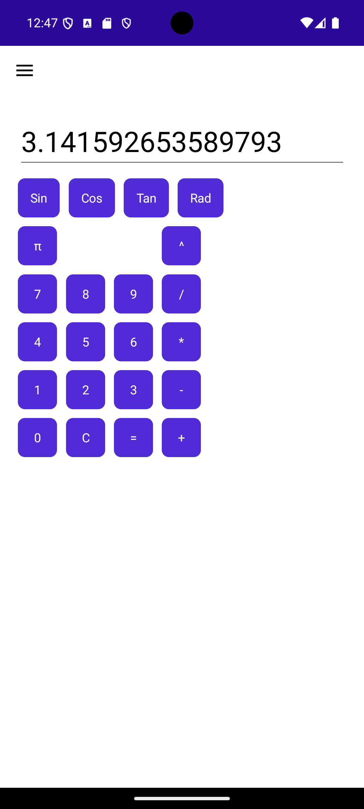

# MauiCalculator

In-progress calculator app made with .NET Multi-platform App UI.

TODO: Add support for consecutive calculations (currently a bug)

3/13/2025 - Supports digit input, with clear function, +, -, /, * operations, ^ operation (exponent), sin, cos, tan, and radians / degrees modes:

3/13/2025 - Supports pi with button:

